## Ejercicios Tema 2: Desarrollo basado en pruebas

#### Ejercicio 1: Instalar alguno de los entornos virtuales de node.js (o de cualquier otro lenguaje con el que se esté familiarizado) y, con ellos, instalar la última versión existente, la versión minor más actual de la 4.x y lo mismo para la 0.11 o alguna impar (de desarrollo).

En mi caso he decidido usar el entorno virtual nvm (Node Version Manager) de node.js. 

Para su instalación, lo primero es ir al repositorio que aparece [enlazado](https://github.com/nvm-sh/nvm) en los apuntes del tema 2:

Lo primero es descargarnos el script de instalación con alguno de los siguientes comandos:

* `$ curl -o- https://raw.githubusercontent.com/creationix/nvm/v0.29.0/install.sh | bash`

* `$ wget -qO- https://raw.githubusercontent.com/nvm-sh/nvm/v0.36.0/install.sh | bash `

Una vez introducido el comando anterior, tendremos el repositorio clonado en ~/.nvm y además se habrá ejecutado el script que se encarga de instalar nvm. Podemos comprobar que nvm se ha instalado correctamente con el siguiente comando.

* `$ command -v nvm` 

El siguiente paso consiste en instalar alguna versión de node.js y para ello, primero debemos ver que versiones hay disponibles con el siguiente comando: 

* `$ nvm ls-remote`

Para instalar la versión más actual hasta el momento podemos usar: 

* `$ nvm install node`

Con esto, nos instala la versión 15.0.1.

Para instalar la versión más actual de la versión 4.x, (la cual es la 4.9.1 como comprobamos al usar `nvm ls-remote` ) debemos usar el siguiente comando.

* `$ nvm install v4.9.1`

También instalamos las versión más recientes de la 0.11, la cual es v.0.11.16 : 

* `$ nvm install v0.11.16`

Alternativamente podemos usar el siguiente comando:

* `$ nvm install unstable` 


Por último podemos ver las versiones instaladas de node.js que tenemos, para ello podemos usar:

* `$ nvm ls`

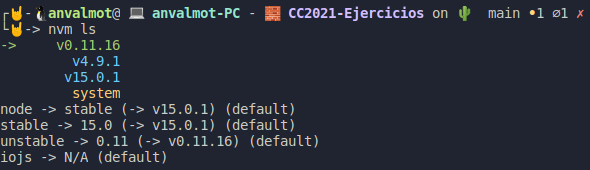

Para cambiar y usar una versión u otra utilizamos el siguiente comando:

* `$ nvm use v15.0.1` 

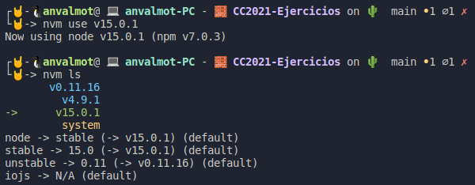

Para detener nvm en la shell actual usamos el siguiente código:

* `$ nvm deactivate`

---

#### Ejercicio 2: Crear una descripción del módulo usando package.json. En caso de que se trate de otro lenguaje, usar el método correspondiente.

Para crear la descripción de un módulo, usaremos un fichero package.json usando el gestor de paquetes npm.

Para generar el fichero, debemos usar el siguiente comando:

* `$ npm init`

Seguiremos los pasos que npm nos indica, y finalmente quedaría un [fichero](src/Tema2/Ej2/package.json) como el siguiente:

```
{
  "name": "ejercicio2",
  "version": "1.0.0",
  "description": "Fichero package.json de ejemplo para el ejercicio 2 del tema 2",
  "main": "./index.js",
  "scripts": {
    "test": "echo \"Error: no test specified\" && exit 1"
  },
  "repository": {
    "type": "git",
    "url": "git+https://github.com/AngelValera/CC2021-Ejercicios.git"
  },
  "author": "Angel Valera Motos <angelvalera.epal@gmail.com>",
  "license": "GNU General Public License v3.0",
  "bugs": {
    "url": "https://github.com/AngelValera/CC2021-Ejercicios/issues"
  },
  "homepage": "https://github.com/AngelValera/CC2021-Ejercicios#readme"
}

```
Para agregar alguna dependencia habría que hacer uso de npm de nuevo, de la siguiente forma:

* `$ npm install <package>`

O bien indicándole la versión concreta del paquete.

* `$ npm install <package>@<version> `

Por ejemplo,

* `$ npm install mysql`
* `$ npm install express@4.17.1`

Esto nos agregará al fichero package.json lo siguiente:

```
    "dependencies": {
    "express": "^4.17.1",
    "mysql": "^2.18.1"
  } 
```
Quedándo el fichero finalmente como se puede ver en la siguiente imagen:


---

#### Ejercicio 3: Descargar el repositorio de ejemplo anterior, instalar las herramientas necesarias (principalmente Scala y sbt) y ejecutar el ejemplo desde sbt. Alternativamente, buscar otros marcos para REST en Scala tales como Finatra o Scalatra y probar los ejemplos que se incluyan en el repositorio.

Para realizar este ejercicio, lo primero que hay que hacer es clonar el [repositorio](https://github.com/JJ/spray-test).

* `$ git clone git://github.com/JJ/spray-test`

El siguiente paso es instalar y configurar Java 8 ya que es un requisito previo a la instalación de Scala.

* `$ sudo apt install openjdk-8-jdk openjdk-8-jre`

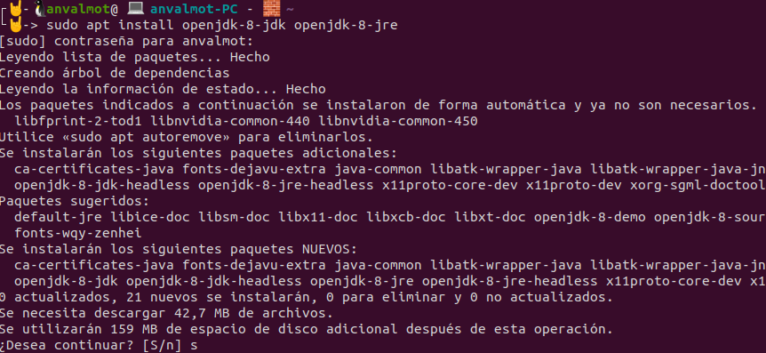

El siguiente paso es instalar tanto [Scala como sbt](http://www.codebind.com/linux-tutorials/install-scala-sbt-java-ubuntu-18-04-lts-linux/). Instalaremos la versión 2.11.8 de Scala y la versión 1.4.1 de sbt.

Una vez instalados, seguimos los pasos que aparecen en el Readme del repositorio, para iniciar sbt, compilar y ejecutar el proyecto. Hecho esto, si todo a ido correctamente, deberíamos poder acceder a  [http://localhost:8080](http://localhost:8080) y ver lo que aparece en la siguiente imagen:

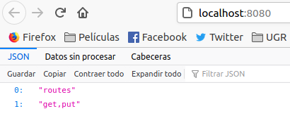

A continuación,  se realizarán las pruebas recomendadas en el repositorio cuyos resultados pueden observarse en la siguiente imagen.

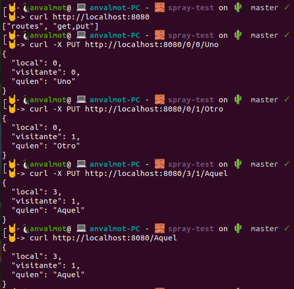


Como se puede comprobar en la siguiente captura, el objetivo de estos test consiste en añadir diversas apuestas a un diccionario de porras especificando para ello el nombre de la persona que apuesta y su resultado. 

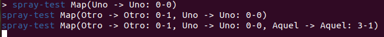

Finalmente paramos el servicio usando :

* `$ re-stop`

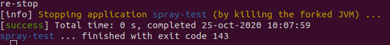


---

#### Ejercicio 4: Para la aplicación que se está haciendo, escribir una serie de aserciones y probar que efectivamente no fallan. Añadir tests para una nueva funcionalidad, probar que falla y escribir el código para que no lo haga. A continuación, ejecutarlos desde mocha (u otro módulo de test de alto nivel), usando descripciones del test y del grupo de test de forma correcta. Si hasta ahora no has subido el código que has venido realizando a GitHub, es el momento de hacerlo, porque lo vamos a necesitar un poco más adelante.

Para realizar este ejercicio se ha creado un proyecto tomando como ejemplo la aplicación sobre gestión de porras que aparecía en el tema 2. La aplicación se puede encontrar en este [repositorio](https://github.com/AngelValera/Gestion_Porras).

Lo primero que se ha hecho a sido crear un fichero [Apuesta.js](https://github.com/AngelValera/Gestion_Porras/blob/main/Apuesta.js) en el que hemos descrito una apuesta.

Posteriormente, se ha creado un primer fichero de test, llamado [test_I.js](https://github.com/AngelValera/Gestion_Porras/blob/main/test_I.js). En este fichero ademas de los asserts que se describían en el tema2 he añadido la creación de una segunda y tercera apuestas, comprobando cada una de ellas por separado para que fuesen correctamente creadas. Finalmente, he añadido tres comprobaciones que se encargan de ver si de las tres apuestas introducidas, hay dos que sean idénticas.

Ejecutamos el fichero usando:

* `$ node test_I.js`

Podemos ver que efectivamente ha pasado los test:

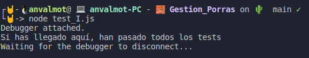

Después se ha instalado mocha y se ha creado un segundo fichero de test, llamado [test_II.js](https://github.com/AngelValera/Gestion_Porras/blob/main/test_II.js). Para instalar mocha y añadirlo a las dependencias del [package.json](https://github.com/AngelValera/Gestion_Porras/blob/main/package.json) se ha ejecutado el siguiente comando:

* `$  npm install mocha  --save-dev`

En este segundo fichero de test, se han incluido además de los dos primeros test que se nos proporcionaban en el tema 2, un test para cada uno de los atributos de una apuesta, de manera que se compruebe lo siguiente:

* Que el nombre del usuario de la apuesta no cambie.
* Que la fecha del partido no cambie.
* Que el nombre del patido no cambie.
* Que la descripción del partido no cambie.
* Que el número de goles del equipo local indicado no cambie.
* Que el número de goles del equipo visitante indicado no cambie.

Al crear estos test, y ejecutarlos usando `$ node test`  ( después de agregar en el fichero package.json en el apartado "scripts"  `"test": "mocha test_II"`), obtuve el siguiente resultado:

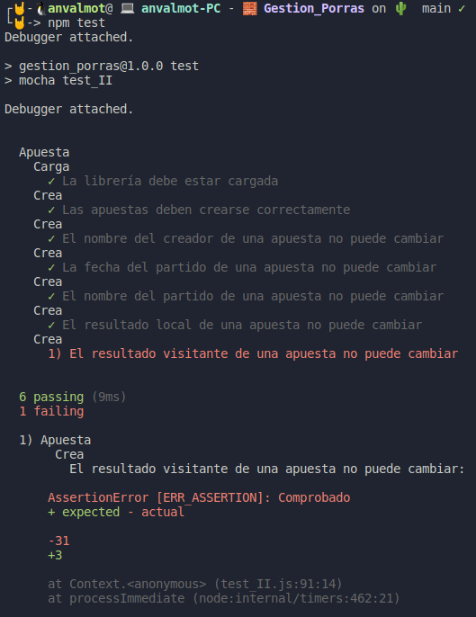

El error se debía a un error de sintaxis en el fichero Apuesta.js, concretamente  en el método que se encarga de devolver el número de goles del equipo visitante, por lo que no pasó el test. 

El test nos está indicando que se esperaba recibir 3 goles, sin embargo recibió 31, y por tanto, no puede pasar el test.

Una vez corregido el error, volví a ejecutar los test y en esta ocasión el resultado fue el siguiente:

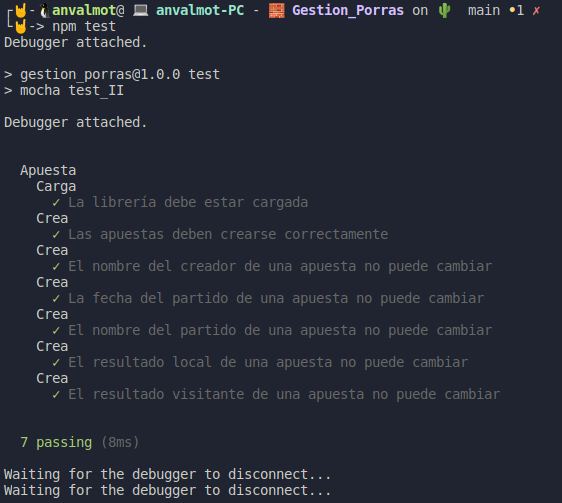


---

#### Ejercicio 5: Haced los dos primeros pasos antes de pasar al tercero.

Estos dos primeros pasos hacen referencia a lo siguiente:

1. Darse de alta. Muchos están conectados con GitHub por lo que puedes usar directamente el usuario ahí. A través de un proceso de autorización, acceder al contenido e incluso informar del resultado de los tests.

2. Activar el repositorio en el que se vaya a aplicar la integración continua. Travis permite hacerlo directamente desde tu configuración; en otros se dan de alta desde la web de GitHub.


3. Crear un fichero de configuración para que se ejecute la integración y añadirlo al repositorio.

Una vez activado el repositorio en travis, tenemos que crear un fichero llamado [.travis.yml](https://github.com/AngelValera/Gestion_Porras/blob/main/.travis.yml) con el siguiente contenido:

```
language: node_js
node_js:
  - "v15.0.1"
before_install:
  - npm install -g mocha
  - npm install .
script: mocha test_II.js
```
Desde travis podemos comprobar que efectivamente, el proyecto ha pasado los test.

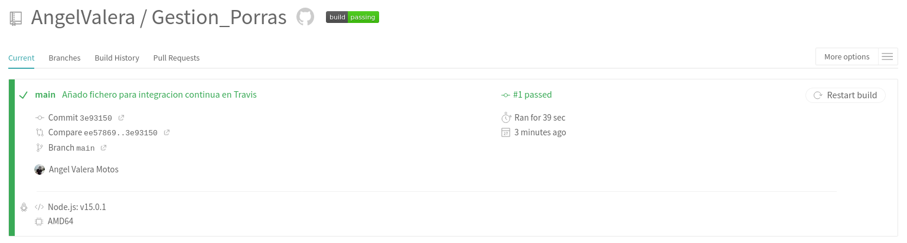

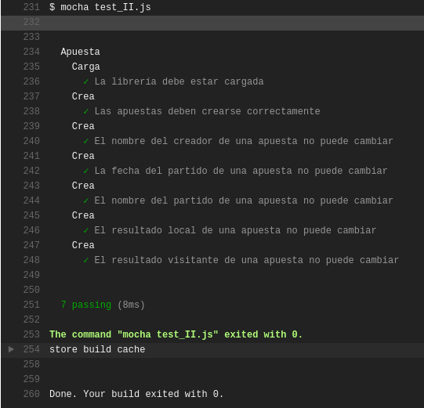

Por último, podemos añadir una imagen en el readme del repositorio que se actualizará si pasa o no pasa los test de travis.

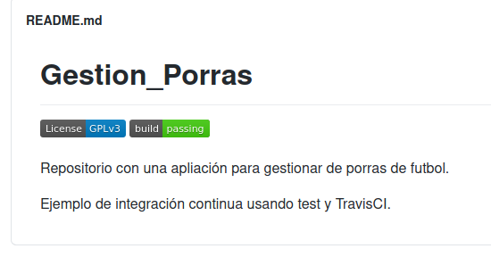
