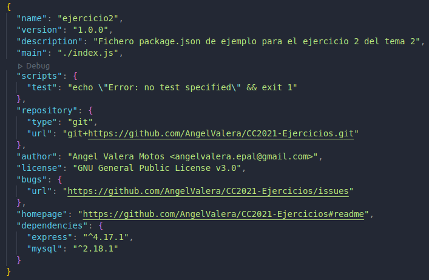

## Ejercicios Tema 2: Desarrollo basado en pruebas

#### Ejercicio 1: Instalar alguno de los entornos virtuales de node.js (o de cualquier otro lenguaje con el que se esté familiarizado) y, con ellos, instalar la última versión existente, la versión minor más actual de la 4.x y lo mismo para la 0.11 o alguna impar (de desarrollo).

En mi caso he decidido usar el entorno virtual nvm (Node Version Manager) de node.js. 

Para su instalación, lo primero es ir al repositorio que aparece [enlazado](https://github.com/nvm-sh/nvm) en los apuntes del tema 2:

Lo primero es descargarnos el script de instalación con alguno de los siguientes comandos:

* `$ curl -o- https://raw.githubusercontent.com/creationix/nvm/v0.29.0/install.sh | bash`

* `$ wget -qO- https://raw.githubusercontent.com/nvm-sh/nvm/v0.36.0/install.sh | bash `

Una vez introducido el comando anterior, tendremos el repositorio clonado en ~/.nvm y además se habrá ejecutado el script que se encarga de instalar nvm. Podemos comprobar que nvm se ha instalado correctamente con el siguiente comando.

* `$ command -v nvm` 

El siguiente paso consiste en instalar alguna versión de node.js y para ello, primero debemos ver que versiones hay disponibles con el siguiente comando: 

* `$ nvm ls-remote`

Para instalar la versión más actual hasta el momento podemos usar: 

* `$ nvm install node`

Con esto, nos instala la versión 15.0.1.

Para instalar la versión más actual de la versión 4.x, (la cual es la 4.9.1 como comprobamos al usar `nvm ls-remote` ) debemos usar el siguiente comando.

* `$ nvm install v4.9.1`

También instalamos las versión más recientes de la 0.11, la cual es v.0.11.16 : 

* `$ nvm install v0.11.16`

Alternativamente podemos usar el siguiente comando:

* `$ nvm install unstable` 


Por último podemos ver las versiones instaladas de node.js que tenemos, para ello podemos usar:

* `$ nvm ls`


Para cambiar y usar una versión u otra utilizamos el siguiente comando:

* `$ nvm use v15.0.1` 


Para detener nvm en la shell actual usamos el siguiente código:

* `$ nvm deactivate`

---

#### Ejercicio 2: Crear una descripción del módulo usando package.json. En caso de que se trate de otro lenguaje, usar el método correspondiente.

Para crear la descripción de un módulo, usaremos un fichero package.json usando el gestor de paquetes npm.

Para generar el fichero, debemos usar el siguiente comando:

* `$ npm init`

Seguiremos los pasos que npm nos indica, y finalmente quedaría un [fichero](src/Tema2/Ej2/package.json) como el siguiente:

```
{
  "name": "ejercicio2",
  "version": "1.0.0",
  "description": "Fichero package.json de ejemplo para el ejercicio 2 del tema 2",
  "main": "./index.js",
  "scripts": {
    "test": "echo \"Error: no test specified\" && exit 1"
  },
  "repository": {
    "type": "git",
    "url": "git+https://github.com/AngelValera/CC2021-Ejercicios.git"
  },
  "author": "Angel Valera Motos <angelvalera.epal@gmail.com>",
  "license": "GNU General Public License v3.0",
  "bugs": {
    "url": "https://github.com/AngelValera/CC2021-Ejercicios/issues"
  },
  "homepage": "https://github.com/AngelValera/CC2021-Ejercicios#readme"
}

```
Para agregar alguna dependencia habría que hacer uso de npm de nuevo, de la siguiente forma:

* `$ npm install <package>`

O bien indicándole la versión concreta del paquete.

* `$ npm install <package>@<version> `

Por ejemplo,

* `$ npm install mysql`
* `$ npm install express@4.17.1`

Esto nos agregará al fichero package.json lo siguiente:

```
    "dependencies": {
    "express": "^4.17.1",
    "mysql": "^2.18.1"
  } 
```
Quedándo el fichero finalmente como se puede ver en la siguiente imagen:



---

#### Ejercicio 3: Descargar el repositorio de ejemplo anterior, instalar las herramientas necesarias (principalmente Scala y sbt) y ejecutar el ejemplo desde sbt. Alternativamente, buscar otros marcos para REST en Scala tales como Finatra o Scalatra y probar los ejemplos que se incluyan en el repositorio.

Para realizar este ejercicio, lo primero que hay que hacer es clonar el [repositorio](https://github.com/JJ/spray-test).

* `$ git clone git://github.com/JJ/spray-test`

El siguiente paso es instalar y configurar Java 8 ya que es un requisito previo a la instalación de Scala.

* `$ sudo apt install openjdk-8-jdk openjdk-8-jre`


El siguiente paso es instalar tanto [Scala como sbt](http://www.codebind.com/linux-tutorials/install-scala-sbt-java-ubuntu-18-04-lts-linux/). Instalaremos la versión 2.11.8 de Scala y la versión 1.4.1 de sbt.

Una vez instalados, seguimos los pasos que aparecen en el Readme del repositorio, para iniciar sbt, compilar y ejecutar el proyecto. Hecho esto, si todo a ido correctamente, deberíamos poder acceder a  [http://localhost:8080](http://localhost:8080) y ver lo que aparece en la siguiente imagen:


A continuación,  se realizarán las pruebas recomendadas en el repositorio cuyos resultados pueden observarse en la siguiente imagen.


Como se puede comprobar en la siguiente captura, el objetivo de estos test consiste en añadir diversas apuestas a un diccionario de porras especificando para ello el nombre de la persona que apuesta y su resultado. 


Finalmente paramos el servicio usando :

* `$ re-stop`


---

#### Ejercicio 4: Para la aplicación que se está haciendo, escribir una serie de aserciones y probar que efectivamente no fallan. Añadir tests para una nueva funcionalidad, probar que falla y escribir el código para que no lo haga. A continuación, ejecutarlos desde mocha (u otro módulo de test de alto nivel), usando descripciones del test y del grupo de test de forma correcta. Si hasta ahora no has subido el código que has venido realizando a GitHub, es el momento de hacerlo, porque lo vamos a necesitar un poco más adelante.

---

#### Ejercicio 5: Haced los dos primeros pasos antes de pasar al tercero.
