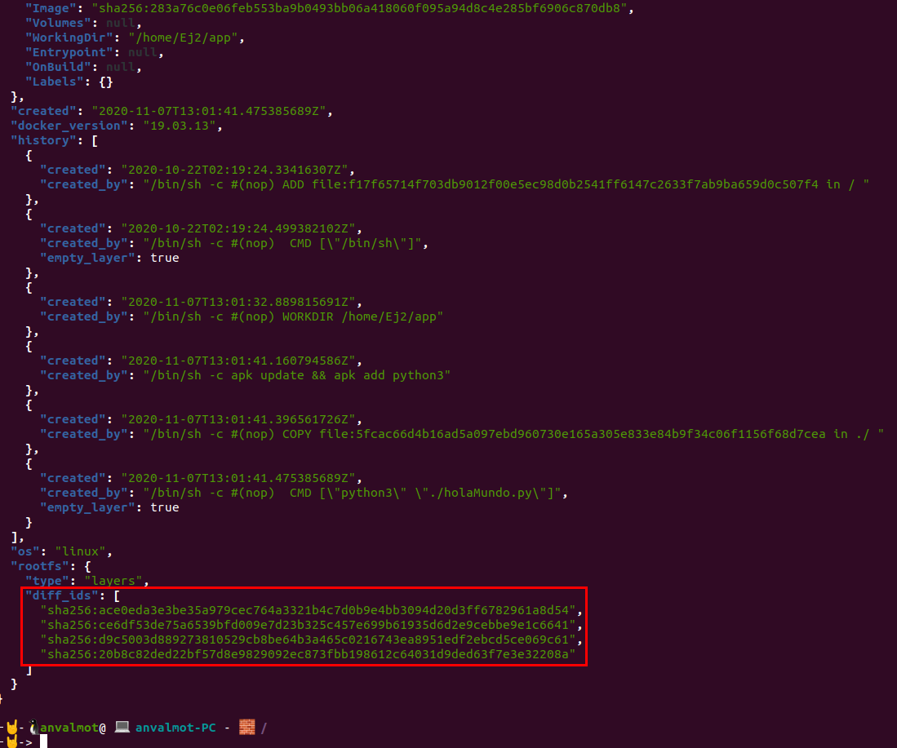
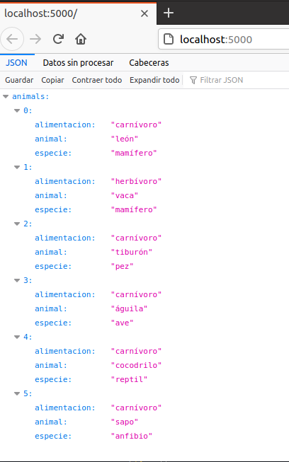
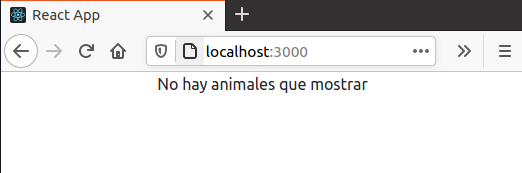

## Ejercicios Tema 3: Contenedores y cómo usarlos

- [Ejercicios Tema 3: Contenedores y cómo usarlos](#ejercicios-tema-3-contenedores-y-cómo-usarlos)
    - [Ejercicio 1: Buscar alguna demo interesante de Docker y ejecutarla localmente, o en su defecto, ejecutar la imagen anterior y ver cómo funciona y los procesos que se llevan a cabo la primera vez que se ejecuta y las siguientes ocasiones.](#ejercicio-1-buscar-alguna-demo-interesante-de-docker-y-ejecutarla-localmente-o-en-su-defecto-ejecutar-la-imagen-anterior-y-ver-cómo-funciona-y-los-procesos-que-se-llevan-a-cabo-la-primera-vez-que-se-ejecuta-y-las-siguientes-ocasiones)
    - [Ejercicio 2: Tomar algún programa simple, “Hola mundo” impreso desde el intérprete de línea de órdenes, y comparar el tamaño de las imágenes de diferentes sistemas operativos base, Fedora, CentOS y Alpine, por ejemplo.](#ejercicio-2-tomar-algún-programa-simple-hola-mundo-impreso-desde-el-intérprete-de-línea-de-órdenes-y-comparar-el-tamaño-de-las-imágenes-de-diferentes-sistemas-operativos-base-fedora-centos-y-alpine-por-ejemplo)
    - [Ejercicio 3: Crear a partir del contenedor anterior una imagen persistente con commit.](#ejercicio-3-crear-a-partir-del-contenedor-anterior-una-imagen-persistente-con-commit)
    - [Ejercicio 4 Examinar la estructura de capas que se forma al crear imágenes nuevas a partir de contenedores que se hayan estado ejecutando.](#ejercicio-4-examinar-la-estructura-de-capas-que-se-forma-al-crear-imágenes-nuevas-a-partir-de-contenedores-que-se-hayan-estado-ejecutando)
    - [Ejercicio 5: Crear un volumen y usarlo, por ejemplo, para escribir la salida de un programa determinado.](#ejercicio-5-crear-un-volumen-y-usarlo-por-ejemplo-para-escribir-la-salida-de-un-programa-determinado)
    - [Ejercicio 6: Reproducir los contenedores creados anteriormente usando un Dockerfile.](#ejercicio-6-reproducir-los-contenedores-creados-anteriormente-usando-un-dockerfile)
    - [Ejercicio 7: Usar un miniframework REST para crear un servicio web y introducirlo en un contenedor, y componerlo con un cliente REST que sea el que finalmente se ejecuta y sirve como “frontend”.](#ejercicio-7-usar-un-miniframework-rest-para-crear-un-servicio-web-y-introducirlo-en-un-contenedor-y-componerlo-con-un-cliente-rest-que-sea-el-que-finalmente-se-ejecuta-y-sirve-como-frontend)

---
#### Ejercicio 1: Buscar alguna demo interesante de Docker y ejecutarla localmente, o en su defecto, ejecutar la imagen anterior y ver cómo funciona y los procesos que se llevan a cabo la primera vez que se ejecuta y las siguientes ocasiones.

En primer lugar lo que se ha hecho ha sido instalar Docker, siguiendo el proceso de instalación para Ubuntu, que aparece en web, y al que se puede acceder directamente desde este [enlace](https://docs.docker.com/engine/install/ubuntu/).

Para realizar este primer ejercicio, se ha utilizado este [contenedor](https://hub.docker.com/r/jjmerelo/docker-daleksay/) de ejemplo.

Para ello se ha ejecutado el siguiente comando:

`docker run --rm jjmerelo/docker-daleksay -f smiling-octopus Uso argumentos, ea`

Podemos ver en la siguiente captura el resultado:


Como se puede apreciar en la captura anterior, en primer lugar, revisa si ya existe la imagen en local y al no encontrarla, entonces la busca en el repositorio remoto y una vez encontrada, entonces, se descarga la última versión.

De aquí en adelante, mientras no eliminemos la imagen de nuestro repositorio local, cuando ejecutemos el contenedor, no se volverá a descargar la imagen desde el remoto.


---
#### Ejercicio 2: Tomar algún programa simple, “Hola mundo” impreso desde el intérprete de línea de órdenes, y comparar el tamaño de las imágenes de diferentes sistemas operativos base, Fedora, CentOS y Alpine, por ejemplo.

Para este ejercicio se ha creado un programa muy simple en python que imprime por consola el mensaje "Hola Mundo", se puede encontrar este programa en el siguiente [fichero](src/Tema3/Ej2/holaMundo.py).

Posteriormente se ha creado un fichero [Dockerfile](src/Tema3/Ej2/Dockerfile), a partir del cual se han creado tres imágenes, una con Fedora, otra con Centos y otra con Alpine.

La creación y ejecución del contenedor con la imagen de Fedora, se puede ver a continuación:


La creación y ejecución del contenedor con la imagen de Centos, se puede ver a continuación:


La creación y ejecución del contenedor con la imagen de Alpine, se puede ver a continuación:


Finalmente, en la siguiente imagen podemos comprobar las imágenes que se han creado, así como sus tamaños.


Como se puede comprobar, la imagen que ha ocupado menos espacio ha sido la imagen que usa Alpine como sistema de base.

---
#### Ejercicio 3: Crear a partir del contenedor anterior una imagen persistente con commit.

Para este ejercicio lo primero será comprobar si tenemos algún contenedor ejecutandose, de no se así podemos ejecutar uno. en mi caso, he vuelto a ejecutar el contenedor que tenía como sistema base Alpine.

Seguidamente, comprobamos que el contenedor se está ejecutando con el siguiente comando:

`docker ps -l `

Copiamos el `CONTAINER ID` y posteriormente ejecutamos el siguiente comando:

`docker commit d3705337d7b4 alpine_holamundo_commit`

Esto efectivamente nos habrá creado una nueva imagen a partir del contenedor cuya id hemos indicado y le asigna el nombre que le hayamos indicado posteriormente.

Podemos ver el proceso completo en la siguiente captura:


---
#### Ejercicio 4 Examinar la estructura de capas que se forma al crear imágenes nuevas a partir de contenedores que se hayan estado ejecutando.

En mi caso para poder ver la estructura de capas que se forma al crear una nueva imagen y partiendo de la imagen que creamos en el ejercicio anterior, debemos hacer lo siguiente:




Como se puede ver hemos tenido que mostrar el contenido de un fichero en formato JSON. 

Concretamente en el apartado "diff_ids" podemos ver las nuevas capas, si comparamos por ejemplo, con las capas de la imagen Alpine de base que podemos ver en la siguiente captura:


---
#### Ejercicio 5: Crear un volumen y usarlo, por ejemplo, para escribir la salida de un programa determinado.

Para crear un nuevo volumen lo que debemos hacer es ejecutar el siguiente comando indicando el nombre que queremos dar al nuevo volumen:

* `docker volume create <Volumen>` 

Para este ejercicio vamos a crear un nuevo volumen llamado "nuevoVolumenEj5":

* `docker volume create nuevoVolumenEj5` 

El siguiente paso es modificar el [programa](src/Tema3/Ej5/holaMundoEj5.py) en python que utilizamos para el segundo ejercicio, haciendo que en este caso, además de escribir por consola "hola mundo" lo haga en un fichero que crearemos dentro de un directorio.

```
#!/usr/bin/env python3
# -*- coding: utf-8 -*-
"""
Hola Mundo para el ejercicio 5 de Contenedores.
@author: Ángel Valera Motos
"""

mensaje = "¡Hola mundo!"

print("¡Hola mundo!")

f = open ('./salida/holamundo.txt','w')
f.write(mensaje)
f.close()
```

Lo siguiente, es escribir el fichero [Dockerfile](src/Tema3/Ej5/Dockerfile):

```
#Imagen con Alpine
FROM alpine:latest

# Establecemos el directorio de trabajo.
WORKDIR /home/Ej5/app

# Instalamos Python 3
RUN apk update && apk add python3

# Copiamos el fichero fuente al directorio de trabajo.
COPY ./holaMundoEj5.py ./

# Ejecutamos el programa
CMD ["python3", "./holaMundoEj5.py"]
```
Una vez escrito el Dockerfile, construimos la imagen:

* `docker build --no-cache -t alpineholamundoej5 -f Dockerfile .`

Montada la imagen ejecutamos el contenedor, indicándole el nombre del volumen que acabamos de crear y le indicamos la ruta del directorio interno del contenedor donde se guardará el fichero con la salida de la ejecución del programa escrito en python.

* `docker run -it --rm  -v nuevoVolumenEj5:/home/Ej5/app/salida  alpineholamundoej5`

El resultado se puede ver en la siguiente captura:


Si accedemos al interior del contenedor al directorio `/home/Ej5/app/salida`, podemos contemplar que efectivamente se ha creado un fichero con la salida del programa:


Si inspeccionamos el volumen podemos ver la ruta donde se ha almacenado:

* `docker inspect nuevoVolumenEj5`
  


Ahora podemos desde fuera del contenedor ver el contenido del volumen y comprobar que efectivamente se encuentra el fichero con la salida del programa que ejecutamos dentro del contenedor:


---
#### Ejercicio 6: Reproducir los contenedores creados anteriormente usando un Dockerfile. 

Este ejercicio se ha ido realizando al mismo tiempo que el resto de ejercicios anteriores. Pueden comprobarse los distintos dockerfiles creados en los siguientes enlaces:

* [Dockerfile Ejercicio 2](src/Tema3/Ej2/Dockerfile)

```shell
# Imagen con Fedora
#FROM fedora
# Imagen con Centos
#FROM centos
#Imagen con Alpine
FROM alpine:latest

# Establecemos el directorio de trabajo.
WORKDIR /home/Ej2/app

# Instalamos Python 3
# para Centos
#RUN dnf -y install python3
# Para Alpine
RUN apk update && apk add python3

# Copiamos el fichero fuente al directorio de trabajo.
COPY ./holaMundo.py ./

# Ejecutamos el programa
CMD ["python3", "./holaMundo.py"]
```

* [Dockerfile Ejercicio 5](src/Tema3/Ej5/Dockerfile)

```shell
#Imagen con Alpine
FROM alpine:latest

# Establecemos el directorio de trabajo.
WORKDIR /home/Ej5/app

# Instalamos Python 3
RUN apk update && apk add python3

# Copiamos el fichero fuente al directorio de trabajo.
COPY ./holaMundoEj5.py ./

# Ejecutamos el programa
CMD ["python3", "./holaMundoEj5.py"]
```

---
#### Ejercicio 7: Usar un miniframework REST para crear un servicio web y introducirlo en un contenedor, y componerlo con un cliente REST que sea el que finalmente se ejecuta y sirve como “frontend”.

Para este ejercicio vamos a crear un servicio web sencillo usando como lenguaje python y como miniframework Flask. Como cliente crearemos un servicio que haga de frontend y usaremos React para ello.


Para realizar este ejercicio he creado un directorio llamado [server](src/Tema3/Ej7/server/) que se encargará de guardar el servidor y otro directorio llamado [client](src/Tema3/Ej7/client/) que se encargará de almacenar el cliente en React.

Para crear el servicio web usando Flask, lo primero que hay que hacer es instalar en nuestra distribución de python, Flask. En mi caso he usado python 3, y por tanto he usado el siguiente comando:

* `pip3 install Flask`

Para que posteriormente nos sea más cómodo crearemos un fichero requirements.txt con todas las dependencias

Una vez instalado, creamos un fichero donde vamos a crear el servidor. Este fichero ha sido llamado [server.py](src/Tema3/Ej7/server/server.py)

```python
from flask import Flask, jsonify
from animals import animals
from flask_cors import CORS
app = Flask(__name__)
CORS(app)


@app.route("/", methods=['GET'])    
def animalsHandler():    
    return jsonify({"animals":animals})


if __name__ == '__main__':
    app.run(debug=True, host='0.0.0.0', port=5000)

```
Como se puede ver en el código anterior, lo que hemos definido a sido una ruta y una respuesta que nuestro servidor debe proporcionar cuando desde el cliente se solicite dicha ruta. La respuesta será en formato json y devolverá un conjunto de animales que previamente hemos definido en el fichero [animals.py](src/Tema3/Ej7/server/animals.py). 

```python
animals = [
    {
        "animal": "león",
        "especie": "mamífero",
        "alimentacion": "carnívoro"
    },
    {
        "animal": "vaca",
        "especie": "mamífero",
        "alimentacion": "herbívoro"
    },
    {
        "animal": "tiburón",
        "especie": "pez",
        "alimentacion": "carnívoro"
    },
    {
        "animal": "águila",
        "especie": "ave",
        "alimentacion": "carnívoro"
    },
    {
        "animal": "cocodrilo",
        "especie": "reptil",
        "alimentacion": "carnívoro"
    },
    {
        "animal": "sapo",
        "especie": "anfibio",
        "alimentacion": "carnívoro"
    }
]
```

Hecho esto si ejecutamos `python3 server.py` el servidor debería funcionar y escucharía en el puerto 5000.

El siguiente paso es definir un Dockerfile para ejecutar este servidor en un contenedor. Para ello hemos escrito el siguiente [dockerfile](src/Tema3/Ej7/server/Dockerfile):


```shell
# Dockerfile
FROM alpine:3.10
RUN apk add --no-cache python3-dev \
    && pip3 install --upgrade pip
WORKDIR /app
COPY . /app
RUN pip3 --no-cache-dir install -r requirements.txt
CMD ["python3","server.py"]
```

Llegados a este punto ya tendríamos lista la parte del servidor y podríamos ejecutarlo usando los siguientes comandos:

* `docker build -t my_docker_flask . `
* `docker run -it  -p 5000:5000  my_docker_flask`



Para crear el cliente vamos a usar React, para ello lo primero es crear el proyecto:

* `npx create-react-app client `

Una vez creado vamos a instalar las principales depedencias:

Para hacer peticiones al servidor
* `yarn add axios` 

Para formatear la tabla donde mostrar los datos
* `yarn add react-bootstrap-table`

Hecho esto, se habrán añadido al fichero [package.json](src/Tema3/Ej7/client/package.json).

Ahora, modificaremos el fichero que se encargará de realizar la petición al servidor usándo axios, recibir la respuesta con los datos y formatearla en una tabla para lo que he usado boostrap. Este fichero en concreto es el [App.js](src/Tema3/Ej7/client/src/App.js)
 
```javascript
import React, { useState } from "react";
import axios from "axios";
import { BootstrapTable, TableHeaderColumn } from "react-bootstrap-table";
import "./App.css";

const App = () => {
  const [values, setValues] = useState({
    animals: [],
  });

  const { animals } = values;

  React.useEffect(() => {
    setValues({ ...values });
    axios({
      method: "GET",
      url: `http://localhost:5000/`,
      headers: {
        "Content-Type": "application/json",
        Accept: "application/json",
      },
    })
      .then(function (response) {
        setValues((values) => ({
          ...values,
          animals: response.data.animals,
        }));
        console.log(response.data.animals);
      })
      .catch(function (error) {
        console.log(error);
      });
  }, []);

  if (animals.length > 0) {
    return (
      <div className="App-header">
        <h1>Animales</h1>
        <BootstrapTable data={animals}>
          <TableHeaderColumn dataField="animal" isKey>Animal</TableHeaderColumn>
          <TableHeaderColumn dataField="especie">Especie</TableHeaderColumn>
          <TableHeaderColumn dataField="alimentacion">Alimentacion</TableHeaderColumn>
        </BootstrapTable>
      </div>
    );
  } else {
    return <p className="text-center">No hay animales que mostrar</p>;
  }
};
export default App;
```

Para que se apliquen los estilos a la tabla hay que importar en el fichero [index.html](src/Tema3/Ej7/client/public/index.html) lo siguiente:

```html
<link rel="stylesheet" href="https://maxcdn.bootstrapcdn.com/bootstrap/4.0.0/css/bootstrap.min.css"
    integrity="sha384-Gn5384xqQ1aoWXA+058RXPxPg6fy4IWvTNh0E263XmFcJlSAwiGgFAW/dAiS6JXm" crossorigin="anonymous">
```

Llegados hasta aquí podríamos ejecutarlo usando:

* `yarn start`

Esto despliega la aplicación en el puerto 3000:



El siguiente paso es definir el [Dockerfile](src/Tema3/Ej7/client/Dockerfile) para ejecutarlo dentro de un contenedor:

```shell
FROM node:12-alpine
RUN mkdir -p /home/node/app/node_modules \
    && chown -R node:node /home/node/app
WORKDIR /home/node/app
COPY package*.json ./
USER node
COPY --chown=node:node . .
RUN yarn  
EXPOSE 3000
CMD ["yarn", "start"]
```
Adicionalmente, para evitar que se copie la carpeta `node_modules` dentro del contenerdo podemos hacer uso de otro fichero denominado [.Dockerignore](src/Tema3/Ej7/client/.Dockerignore):

```shell
./node_modules
```
Ejecutamos el contenedor usando los siguientes comandos:

* `docker build -t my_docker_react . `
* `docker run -it -p 3000:3000  my_docker_react`

Con esto tendríamos los dos servicios montados por separado, el siguiente paso es agruparlos y desplegarlos a la misma vez. Para esto definimos un nuevo fichero en el raíz del ejercicio, al que llamamos [docker-compose.yml](src/Tema3/Ej7/docker-compose.yml) y en el que incluimos lo siguiente:

```yml
version: '2'
services:
   server:
      container_name: server
      restart: always
      build: server/.
      ports:
      - "5000:5000"

   client:
      container_name: client
      build: client/.
      stdin_open: true
      ports:
      - "3000:3000"
```
como se puede ver, definimos dos servicios uno servidor y otro cliente, escuchando en sus respectivos puertos y le indicamos también los respectivos directorios. Esto hará que busquen en dichos directorios el correspondiente fichero Dockerfile y lo ejecute:

Para desplegar ambos servicios, debemos ejecutar los siguientes comandos:

Si queremos que cree la imagen de nuevo si ya estaban creadas:
* `docker-compose up --build`
Si solo queremos que levante los servicios:
* `docker-compose up`

Podemos ver a continuación que ambos servicios se han levantado:


Finalmente, podemos comprobar que ahora tenemos desplegados y ejecutándose ambos contenedores:


---
