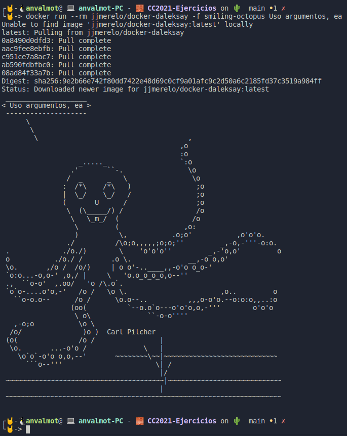
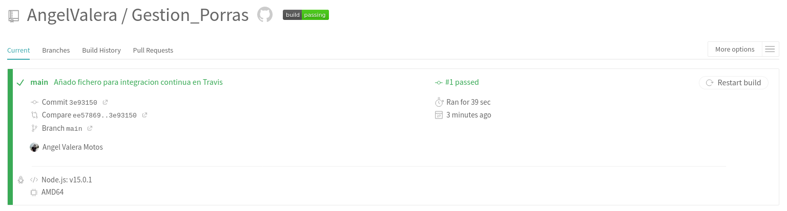
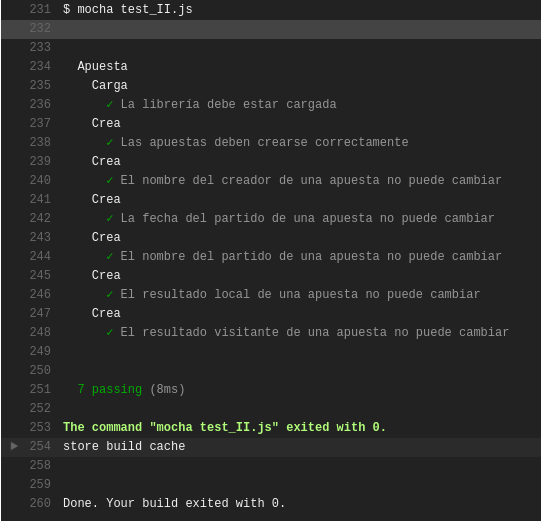
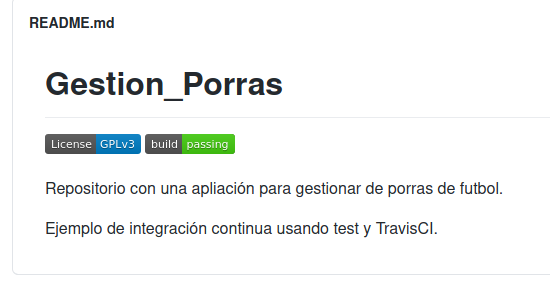

## Ejercicios Tema 4: Integración continua

<!-- 
[enlace](https://docs.docker.com/engine/install/ubuntu/).



 -->

- [Ejercicios Tema 4: Integración continua](#ejercicios-tema-4-integración-continua)
    - [Ejercicio 1: Haced los dos primeros pasos antes de pasar al tercero.](#ejercicio-1-haced-los-dos-primeros-pasos-antes-de-pasar-al-tercero)
    - [Ejercicio 2: Configurar integración continua para nuestra aplicación usando Travis o algún otro sitio.](#ejercicio-2-configurar-integración-continua-para-nuestra-aplicación-usando-travis-o-algún-otro-sitio)


---
#### Ejercicio 1: Haced los dos primeros pasos antes de pasar al tercero.

Estos dos primeros pasos hacen referencia a lo siguiente:

1. Darse de alta. Muchos están conectados con GitHub por lo que puedes usar directamente el usuario ahí. A través de un proceso de autorización, acceder al contenido e incluso informar del resultado de los tests.

2. Activar el repositorio en el que se vaya a aplicar la integración continua. Travis permite hacerlo directamente desde tu configuración; en otros se dan de alta desde la web de GitHub.


3. Crear un fichero de configuración para que se ejecute la integración y añadirlo al repositorio.

Una vez activado el repositorio en travis, tenemos que crear un fichero llamado [.travis.yml](https://github.com/AngelValera/Gestion_Porras/blob/main/.travis.yml) con el siguiente contenido:

```yml
language: node_js
node_js:
  - "v15.0.1"
before_install:
  - npm install -g mocha
  - npm install .
script: mocha test_II.js
```

---
#### Ejercicio 2: Configurar integración continua para nuestra aplicación usando Travis o algún otro sitio.

Una vez que tenemos el fichero creado solo tenemos que actualizar el repositorio y desde travis podemos comprobar que efectivamente, el proyecto ha pasado los test.





Por último, podemos añadir una imagen en el readme del repositorio que se actualizará si pasa o no pasa los test de travis.


