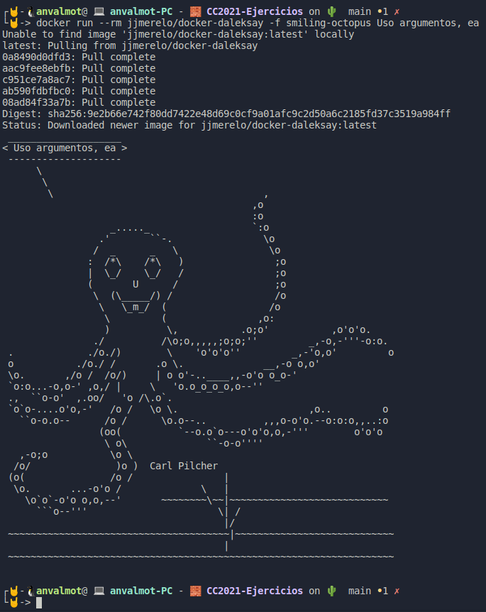

## Ejercicios Tema 6: Microservicios

<!-- 
[enlace](https://docs.docker.com/engine/install/ubuntu/).


 -->

- [Ejercicios Tema 6: Microservicios](#ejercicios-tema-6-microservicios)
    - [Ejercicio 1: Instalar etcd3, averiguar qué bibliotecas funcionan bien con el lenguaje que estemos escribiendo el proyecto (u otro lenguaje), y hacer un pequeño ejemplo de almacenamiento y recuperación de una clave; hacer el almacenamiento desde la línea de órdenes (con etcdctl) y la recuperación desde el mini-programa que hagáis.](#ejercicio-1-instalar-etcd3-averiguar-qué-bibliotecas-funcionan-bien-con-el-lenguaje-que-estemos-escribiendo-el-proyecto-u-otro-lenguaje-y-hacer-un-pequeño-ejemplo-de-almacenamiento-y-recuperación-de-una-clave-hacer-el-almacenamiento-desde-la-línea-de-órdenes-con-etcdctl-y-la-recuperación-desde-el-mini-programa-que-hagáis)
    - [Ejercicio 2: Realizar una aplicación básica que use express para devolver alguna estructura de datos del modelo que se viene usando en el curso.](#ejercicio-2-realizar-una-aplicación-básica-que-use-express-para-devolver-alguna-estructura-de-datos-del-modelo-que-se-viene-usando-en-el-curso)
    - [Ejercicio 3: Programar un microservicio en express (o el lenguaje y marco elegido) que incluya variables como en el caso anterior.](#ejercicio-3-programar-un-microservicio-en-express-o-el-lenguaje-y-marco-elegido-que-incluya-variables-como-en-el-caso-anterior)
    - [Ejercicio 4: Crear pruebas para las diferentes rutas de la aplicación.](#ejercicio-4-crear-pruebas-para-las-diferentes-rutas-de-la-aplicación)
    - [Ejercicio 5: Experimentar con diferentes gestores de procesos y servidores web front-end para un microservicio que se haya hecho con antelación, por ejemplo en la sección anterior.](#ejercicio-5-experimentar-con-diferentes-gestores-de-procesos-y-servidores-web-front-end-para-un-microservicio-que-se-haya-hecho-con-antelación-por-ejemplo-en-la-sección-anterior)
    - [Ejercicio 6: Usar rake, invoke o la herramienta equivalente en tu lenguaje de programación para programar diferentes tareas que se puedan lanzar fácilmente desde la línea de órdenes.](#ejercicio-6-usar-rake-invoke-o-la-herramienta-equivalente-en-tu-lenguaje-de-programación-para-programar-diferentes-tareas-que-se-puedan-lanzar-fácilmente-desde-la-línea-de-órdenes)

---
#### Ejercicio 1: Instalar etcd3, averiguar qué bibliotecas funcionan bien con el lenguaje que estemos escribiendo el proyecto (u otro lenguaje), y hacer un pequeño ejemplo de almacenamiento y recuperación de una clave; hacer el almacenamiento desde la línea de órdenes (con etcdctl) y la recuperación desde el mini-programa que hagáis.

Para este ejercicio, lo primero que debemos hacer es instalar Etcd3 en nuestro sistema. Para esto, he seguido las indicaciones del siguiente [tutorial](https://computingforgeeks.com/how-to-install-etcd-on-ubuntu-18-04-ubuntu-16-04/).

En la siguiente captura podemos comprobar que Etcdl3 está correctamente instalado.


Una vez configurado, vamos a utilizar las órdenes `PUT` y `GET`, para guardar una variable y posteriormente obtenerla.


Para utilizar Etcd3, en Nodejs, podemos utilizar la biblioteca [etcd3](https://www.npmjs.com/package/etcd3). Tal y como ahí se indica, instalamos etcd3 usando npm

`npm install --save etcd3`

Podemos crear un pequeño [script](src/Tema6/Ej1/pruebaEtcd.js) que nos permita probar su uso. Vamos a obtener la variable que guardamos anteriormente y además vamos a grabar una nueva variable y posteriormente obtenerla.


```javascript
const { Etcd3 } = require("etcd3");
const client = new Etcd3();

(async () => {
  await client.put("puertoPrueba2").value("3002");
  console.log("puertoPrueba2:", await client.get("puertoPrueba2").string());
  console.log("puertoPrueba:", await client.get("puertoPrueba").string());  
})();
```
Tras ejecutarlo, obtendríamos la siguiente salida:


---
#### Ejercicio 2: Realizar una aplicación básica que use express para devolver alguna estructura de datos del modelo que se viene usando en el curso.

Vamos a crear desde el principio una aplicación sencilla usando node.js y express.

El primer paso consiste en crear el proyecto usando:

* `npm init -y`

Posteriormente, instalamos las dependencias que vamos a necesitar, en mi caso he usado:
- `npm install express morgan`
- `npm install nodemon -D`

Hecho esto creamos un fichero dentro del directorio `/src`, llamado [index.js](./src/Tema6/Ej2/src/index.js). Dentro de este fichero, definiremos nuestro servidor que se encargará de servir en una ruta, los datos relativos a varios animales.

```javascript
const express = require('express');
const app = express();
const morgan = require('morgan');
const animales = require('./data/animales.json');

// Settings
app.set("port", process.env.PORT || 3000);
app.set('json spaces', 2);

//Middlewares
app.use(morgan('dev'));
app.use(express.urlencoded({extended: false}));
app.use(express.json());

//Routes
app.get("/animals", (req, res) => {   
  res.json(animales);
});

//Starting the server
app.listen(app.get('port'), ()=> {
   console.log(`Server on port ${app.get("port")}`); 
});

```

Para definir los datos de los animales, he creado un fichero llamado [animales.json](./src/Tema6/Ej2/src/data/animales.json), dentro del directorio `/data`.

```json
{
  "animales": 
  [
    {
      "animal": "león",
      "especie": "mamífero",
      "alimentacion": "carnívoro"
    },
    {
      "animal": "vaca",
      "especie": "mamífero",
      "alimentacion": "herbívoro"
    },
    {
      "animal": "tiburón",
      "especie": "pez",
      "alimentacion": "carnívoro"
    },
    {
      "animal": "águila",
      "especie": "ave",
      "alimentacion": "carnívoro"
    },
    {
      "animal": "cocodrilo",
      "especie": "reptil",
      "alimentacion": "carnívoro"
    },
    {
      "animal": "sapo",
      "especie": "anfibio",
      "alimentacion": "carnívoro"
    }
  ]
}
```
Para ejecutar nuestro servidor, de una manera más comoda, definimos en el fichero [package.json](./src/Tema6/Ej2/package.json) un script que hace uso de la biblioteca Nodemon.

```json
{
  "name": "ej2",
  "version": "1.0.0",
  "description": "",
  "main": "index.js",
  "scripts": {
    "dev": "nodemon src/index.js"
  },
  "keywords": [],
  "author": "",
  "license": "ISC",
  "devDependencies": {    
    "nodemon": "^2.0.7"
  },
  "dependencies": {
    "express": "^4.17.1",
    "morgan": "^1.10.0"
  }
}
```

Podemos comprobar que efectivamente se está sirviendo dichos datos, accediendo desde el navegador a la ruta definida:

`http://localhost:3000/animals`


O bien desde Curl:


O bien desde Postman:


También podemos hacer uso de la biblioteca Morgan para ver que las peticiones que se están realizando al servidor se hacen correctamente:


---
#### Ejercicio 3: Programar un microservicio en express (o el lenguaje y marco elegido) que incluya variables como en el caso anterior.

---
#### Ejercicio 4: Crear pruebas para las diferentes rutas de la aplicación.

---
#### Ejercicio 5: Experimentar con diferentes gestores de procesos y servidores web front-end para un microservicio que se haya hecho con antelación, por ejemplo en la sección anterior.

---
#### Ejercicio 6: Usar rake, invoke o la herramienta equivalente en tu lenguaje de programación para programar diferentes tareas que se puedan lanzar fácilmente desde la línea de órdenes.