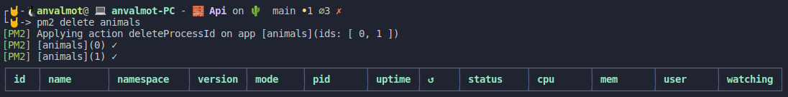

## Ejercicios Tema 6: Microservicios

<!-- 
[enlace](https://docs.docker.com/engine/install/ubuntu/).


 -->

- [Ejercicios Tema 6: Microservicios](#ejercicios-tema-6-microservicios)
    - [Ejercicio 1: Instalar etcd3, averiguar qué bibliotecas funcionan bien con el lenguaje que estemos escribiendo el proyecto (u otro lenguaje), y hacer un pequeño ejemplo de almacenamiento y recuperación de una clave; hacer el almacenamiento desde la línea de órdenes (con etcdctl) y la recuperación desde el mini-programa que hagáis.](#ejercicio-1-instalar-etcd3-averiguar-qué-bibliotecas-funcionan-bien-con-el-lenguaje-que-estemos-escribiendo-el-proyecto-u-otro-lenguaje-y-hacer-un-pequeño-ejemplo-de-almacenamiento-y-recuperación-de-una-clave-hacer-el-almacenamiento-desde-la-línea-de-órdenes-con-etcdctl-y-la-recuperación-desde-el-mini-programa-que-hagáis)
    - [Ejercicio 2: Realizar una aplicación básica que use express para devolver alguna estructura de datos del modelo que se viene usando en el curso.](#ejercicio-2-realizar-una-aplicación-básica-que-use-express-para-devolver-alguna-estructura-de-datos-del-modelo-que-se-viene-usando-en-el-curso)
    - [Ejercicio 3: Programar un microservicio en express (o el lenguaje y marco elegido) que incluya variables como en el caso anterior.](#ejercicio-3-programar-un-microservicio-en-express-o-el-lenguaje-y-marco-elegido-que-incluya-variables-como-en-el-caso-anterior)
    - [Ejercicio 4: Crear pruebas para las diferentes rutas de la aplicación.](#ejercicio-4-crear-pruebas-para-las-diferentes-rutas-de-la-aplicación)
    - [Ejercicio 5: Experimentar con diferentes gestores de procesos y servidores web front-end para un microservicio que se haya hecho con antelación, por ejemplo en la sección anterior.](#ejercicio-5-experimentar-con-diferentes-gestores-de-procesos-y-servidores-web-front-end-para-un-microservicio-que-se-haya-hecho-con-antelación-por-ejemplo-en-la-sección-anterior)
    - [Ejercicio 6: Usar rake, invoke o la herramienta equivalente en tu lenguaje de programación para programar diferentes tareas que se puedan lanzar fácilmente desde la línea de órdenes.](#ejercicio-6-usar-rake-invoke-o-la-herramienta-equivalente-en-tu-lenguaje-de-programación-para-programar-diferentes-tareas-que-se-puedan-lanzar-fácilmente-desde-la-línea-de-órdenes)

---
#### Ejercicio 1: Instalar etcd3, averiguar qué bibliotecas funcionan bien con el lenguaje que estemos escribiendo el proyecto (u otro lenguaje), y hacer un pequeño ejemplo de almacenamiento y recuperación de una clave; hacer el almacenamiento desde la línea de órdenes (con etcdctl) y la recuperación desde el mini-programa que hagáis.

Para este ejercicio, lo primero que debemos hacer es instalar Etcd3 en nuestro sistema. Para esto, he seguido las indicaciones del siguiente [tutorial](https://computingforgeeks.com/how-to-install-etcd-on-ubuntu-18-04-ubuntu-16-04/).

En la siguiente captura podemos comprobar que Etcdl3 está correctamente instalado.


Una vez configurado, vamos a utilizar las órdenes `PUT` y `GET`, para guardar una variable y posteriormente obtenerla.


Para utilizar Etcd3, en Nodejs, podemos utilizar la biblioteca [etcd3](https://www.npmjs.com/package/etcd3). Tal y como ahí se indica, instalamos etcd3 usando npm

`npm install --save etcd3`

Podemos crear un pequeño [script](src/Tema6/Ej1/pruebaEtcd.js) que nos permita probar su uso. Vamos a obtener la variable que guardamos anteriormente y además vamos a grabar una nueva variable y posteriormente obtenerla.


```javascript
const { Etcd3 } = require("etcd3");
const client = new Etcd3();

(async () => {
  await client.put("puertoPrueba2").value("3002");
  console.log("puertoPrueba2:", await client.get("puertoPrueba2").string());
  console.log("puertoPrueba:", await client.get("puertoPrueba").string());  
})();
```
Tras ejecutarlo, obtendríamos la siguiente salida:


---
#### Ejercicio 2: Realizar una aplicación básica que use express para devolver alguna estructura de datos del modelo que se viene usando en el curso.

Vamos a crear desde el principio una aplicación sencilla usando node.js y express.

El primer paso consiste en crear el proyecto usando:

* `npm init -y`

Posteriormente, instalamos las dependencias que vamos a necesitar, en mi caso he usado:
- `npm install express morgan`
- `npm install nodemon -D`

Hecho esto creamos un fichero dentro del directorio `/src`, llamado index.js. Dentro de este fichero, definiremos nuestro servidor que se encargará de servir en una ruta, los datos relativos a varios animales.

```javascript
const express = require('express');
const app = express();
const morgan = require('morgan');
const animales = require('./data/animales.json');

// Settings
app.set("port", process.env.PORT || 3000);
app.set('json spaces', 2);

//Middlewares
app.use(morgan('dev'));
app.use(express.urlencoded({extended: false}));
app.use(express.json());

//Routes
app.get("/animals", (req, res) => {   
  res.json(animales);
});

//Starting the server
app.listen(app.get('port'), ()=> {
   console.log(`Server on port ${app.get("port")}`); 
});

```

Para definir los datos de los animales, he creado un fichero llamado [animales.json](./src/Tema6/Api/src/data/animales.json), dentro del directorio `/data`.

```json
{
  "animales": 
  [
    {
      "animal": "león",
      "especie": "mamífero",
      "alimentacion": "carnívoro"
    },
    {
      "animal": "vaca",
      "especie": "mamífero",
      "alimentacion": "herbívoro"
    },
    {
      "animal": "tiburón",
      "especie": "pez",
      "alimentacion": "carnívoro"
    },
    {
      "animal": "águila",
      "especie": "ave",
      "alimentacion": "carnívoro"
    },
    {
      "animal": "cocodrilo",
      "especie": "reptil",
      "alimentacion": "carnívoro"
    },
    {
      "animal": "sapo",
      "especie": "anfibio",
      "alimentacion": "carnívoro"
    }
  ]
}
```
Para ejecutar nuestro servidor, de una manera más comoda, definimos en el fichero [package.json](./src/Tema6/Api/package.json) un script que hace uso de la biblioteca Nodemon.

```json
{
  "name": "ej2",
  "version": "1.0.0",
  "description": "",
  "main": "index.js",
  "scripts": {
    "dev": "nodemon src/index.js"
  },
  "keywords": [],
  "author": "",
  "license": "ISC",
  "devDependencies": {    
    "nodemon": "^2.0.7"
  },
  "dependencies": {
    "express": "^4.17.1",
    "morgan": "^1.10.0"
  }
}
```

Podemos comprobar que efectivamente se está sirviendo dichos datos, accediendo desde el navegador a la ruta definida:

`http://localhost:3000/animals`


O bien desde Curl:


O bien desde Postman:


También podemos hacer uso de la biblioteca Morgan para ver que las peticiones que se están realizando al servidor se hacen correctamente:


---
#### Ejercicio 3: Programar un microservicio en express (o el lenguaje y marco elegido) que incluya variables como en el caso anterior.


Partiendo de la aplicación anterior, vamos a definir un microservicio que se encarge de servir datos sobre distintos animales.

El api se puede encontrar en el siguiente [directorio](./src/Tema6/Api).
```
├── Api
    ├── src
        ├── data
            ├── animales.json
        ├── routes
            ├── index.js
        ├── index.js
    ├── package-lock.json
    ├── package.json
```
En el fichero [index.js](./src/Tema6/Api/src/index.js) del directorio `/src` hemos eliminado las definición de las distintas rutas y hemos agregado el uso de la biblioteca etcd3 para definir el puerto del servidor.

```javascript
const express = require('express');
const app = express();
const morgan = require('morgan');

const { Etcd3 } = require("etcd3");
const client = new Etcd3();

async function getPort() {
  const port = await client.get("AnimalsPort");
  return port;
}

// Settings
//app.set("port", process.env.PORT || 3000);
app.set('json spaces', 2);

//Middlewares
app.use(morgan('dev'));
app.use(express.urlencoded({extended: false}));
app.use(express.json());

//Routes
app.use(require('./routes/index'));

app.use(function (request, response) {
  response.status(400);
  response.json({
    error: {
      name: "Error",
      message: "Debe acceder a la ruta: /animals",
    },
  });
});

//Starting the server
(async () => {    
  let PORT = await getPort();  
  app.set("port", PORT || process.env.PORT || 3000);    
})().then(() => {
  app.listen(app.get("port"), () => {
    console.log(`Server on port ${app.get("port")}`);
  });
});

```
Las rutas ahora están definidas en el fichero [index.js](./src/Tema6/Api/src/routes/index.js) del directorio `/routes`. 

```javascript
const { Router } = require('express');
const router = Router();
const animales = require("../data/animales.json");

router.get("/animals", (req, res) => {
  res.status(200);
  res.header("Content-Type", "application/json");
  res.json(animales);   
});

router.get("/animals/:id", (req, res) => {
  if (animales.animales.hasOwnProperty(req.params.id)) {
    res.status(200);
    res.header("Content-Type", "application/json");
    res.json(animales.animales[req.params.id]);
  }else{
    res.status(400).send("No existe ese animal");;
  }  
});

router.post("/animals/:animal/:especie/:alimentacion", (req, res) => {
  
  let id = animales.animales.push({
    animal: req.params.animal,
    especie: req.params.especie,
    alimentacion: req.params.alimentacion
  });   
  console.log(animales.animales[id - 1]);
  res.status(200);
  res.send({
    animal: animales.animales[id-1],
    message: "Animal POST ok",
  });
});
module.exports = router;
```
Como se puede ver se han definido 3 rutas principales. Dos de ellas utilizan `GET` y la otra utiliza `POST`.

- **GET** `/animals`: Devuelve todos los animales.
- **GET** `/animals/:id`: Devuelve el animal cuyo id pasemos como parámetro. También comprobamos que el id exista y en caso negativo devolvemos un código 404 con un mensaje.
- **POST** `/animals/:animal/:especie/:alimentacion`: Creamos un nuevo animal cuyos datos son los que pasemos por parámetro.

Acontinuación vamos a ver cómo se han probado cada una de las distintas rutas del servicio usando postman.


Una vez creado el nuevo animal, si decidimos volver a obtener todos los animales, nos aparecerá.


---
#### Ejercicio 4: Crear pruebas para las diferentes rutas de la aplicación.

Para testear las distintas rutas de nuestro servicio, vamos a utilizar las bibliotecas `mocha` y `supertest`. Las cuales instalamos de la siguiente manera:

- `npm install --save -g mocha`
- `npm install --save supertest`

A continuación, el siguiente paso es crear en nuestro proyecto un nuevo directorio llamado `/test` y agregar el siguiente [fichero](./src/Tema6/Api/test/animals.test.js):

```javascript
var request = require("supertest");
app = require("../src/index.js");


describe("Animales", () => {  
  describe("GET", () => {
    it("Deberia devolver una lista con todos los animales", (done) => {
      request(app)
        .get("/animals")
        .expect("Content-Type", /json/)
        .expect(200, done);
    });
  });
});

describe("Un solo Animal", () => {
  describe("GET", () => {
    it("Deberia devolver un solo animal", (done) => {
      request(app)
        .get("/animals/0")
        .expect("Content-Type", /json/)
        .expect(200, done);
    });
  });
});

describe("Un nuevo Animal", () => {
  describe("POST", () => {
    it("Deberia crear un nuevo animal", (done) => {
      request(app)
        .post("/animals/cabra/mamifero/herbivoro")
        .expect("Content-Type", /json/)
        .expect(200, done);
    });
  });
});
```

Como se puede ver en el fichero anterior, hemos creado un test para cada ruta, de manera que al ejecutarlo, nos lo debe dar por bueno.


---
#### Ejercicio 5: Experimentar con diferentes gestores de procesos y servidores web front-end para un microservicio que se haya hecho con antelación, por ejemplo en la sección anterior.

Dentro de los gestores de procesos disponibles para NodeJS, podemos encontrar **PM2** y **Forever** entre otros:

**PM2**

En primer lugar utilizaré PM2. Para ello, lo primero es instalarlo:

- `npm install --save -g pm2`

Una vez instalado, podemos inicializarlo mediante el siguiente comando:

- `pm2 start ./src/index.js --name "animals" -i 2`

Con esto, pm2 iniciará 2 instancias de nustro microservicio.


Para para el servicio podemos usar:

- `pm2 stop animals`
   


Para volver a lanzar las instancias, podemos usar:

- `pm2 reload animals`


Por último, una de las funciones interesantes de PM2 es poder ver la información de las diferentes instancias, para ello usamos:

- `pm2 describe animals`


Por último, podemos eliminar los procesos, para ello, podemos usar:

- `pm2 delete animals`



**Forever**

-En segundo lugar utilizaré Forever. Para ello, lo primero es instalarlo:

- `npm install --save -g forever`

Una vez instalado, podemos inicializarlo mediante el siguiente comando:

- `forever start ./src/index.js `


Podemos listar los procesos activos, para ello podemos usar:

- `forever list`


Podemos parar todos los procesos, para ello podemos usar:

- `forever stopall`


#### Ejercicio 6: Usar rake, invoke o la herramienta equivalente en tu lenguaje de programación para programar diferentes tareas que se puedan lanzar fácilmente desde la línea de órdenes.

Para este ejerciciovamos a utilizar el gestor de tareas Grunt. De manera que lo primero que haremos será instalarlo:

- `npm install -g grunt-cli`
- `npm install grunt-cli`

Una vez instalado, instalaremos también los plugins para poder definir las tareas necesarias.

- `npm install grunt-run`
- `npm install grunt-mocha-test` 

Una vez hecho esto, desde el directorio raiz de nuestro proyecto, crearemos el fichero [Gruntfile.js](./src/Tema6/Api/Gruntfile.js).

```javascript
module.exports = function (grunt) {
  // Configuración del proyecto
  grunt.initConfig({
    pkg: grunt.file.readJSON("package.json"),
    mochaTest: {
      test: {
        options: {
          reporter: "spec",
          quiet: false,
          ui: "bdd",
        },
        src: ["test/**/*.js"],
      },
    },
    run: {
      start: {
        cmd: "pm2",
        args: ["start", "./src/index.js", "--name", "animals", "-i", "2"],
      },
      stop: {
        cmd: "pm2",
        args: ["stop", "animals"],
      },
    }    
  });

  // Carga los plugins de grunt
  grunt.loadNpmTasks("grunt-mocha-test");
  grunt.loadNpmTasks("grunt-run");
  // Tareas
  grunt.registerTask("test", ["mochaTest"]);  
  grunt.registerTask("start", ["run:start"]);
  grunt.registerTask("stop", ["run:stop"]);
};
```
Como se puede ver se han definido 3 tareas. La primera tarea se encarga de ejecutar los test, la segunda ejecuta dos instancias del servicio usando pm2 y la última tarea, finaliza la ejecución de dichas instancias.


