## Ejercicios Tema 7: Composición de servicios

<!-- 
[enlace](https://docs.docker.com/engine/install/ubuntu/).


 -->

- [Ejercicios Tema 7: Composición de servicios](#ejercicios-tema-7-composición-de-servicios)
    - [Ejercicio 1: Crear un pod con dos o más contenedores, de forma que se pueda usar uno desde el otro. Uno de los contenedores contendrá la aplicación que queramos desplegar.](#ejercicio-1-crear-un-pod-con-dos-o-más-contenedores-de-forma-que-se-pueda-usar-uno-desde-el-otro-uno-de-los-contenedores-contendrá-la-aplicación-que-queramos-desplegar)
    - [Ejercicio 2: Usar un miniframework REST para crear un servicio web y introducirlo en un contenedor, y componerlo con un cliente REST que sea el que finalmente se ejecuta y sirve como “frontend”.](#ejercicio-2-usar-un-miniframework-rest-para-crear-un-servicio-web-y-introducirlo-en-un-contenedor-y-componerlo-con-un-cliente-rest-que-sea-el-que-finalmente-se-ejecuta-y-sirve-como-frontend)

---
#### Ejercicio 1: Crear un pod con dos o más contenedores, de forma que se pueda usar uno desde el otro. Uno de los contenedores contendrá la aplicación que queramos desplegar.
 
En primer lugar lo que debemos hacer es instalar [Podman](https://podman.io/getting-started/installation). En mi caso al instalarlo sobre una distribución de Linux, he tenido que usar los siguiente comandos:

```shell
# Ubuntu 20.10 and newer
sudo apt-get -y update
sudo apt-get -y install podman
```
Una vez instalado comprobamos que efectivamente, se ha instalado correctamente:

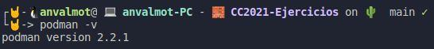

A continuación, vamos a seguir el ejemplo que se indica en el siguiente [enlace](https://www.redhat.com/sysadmin/compose-podman-pods). En este ejemplo, se hace uso de dos contenedores, uno contiene MariaDB y el otro contiene Wordpress. Posteriormente, lo que hacemos es componer ambos contenedores para que puedan trabajar juntos.

Lo primero que debemos hacer es crear un pod, indicándo que el puerto externo 8080, será el puerto 80 interno que podman usará.

```shell
sudo podman pod create --name my-pod -p 8080:80
```
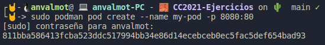

El siguiente paso es crear un contenedor dentro del pod que acabamos de crear, para ello usamos `podman run`. 

Según lo anterior, vamos a crear el contenedor de MariaDB.

```shell
sudo podman run \
-d --restart=always --pod=my-pod \
-e MYSQL_ROOT_PASSWORD="myrootpass" \
-e MYSQL_DATABASE="wp" \
-e MYSQL_USER="wordpress" \
-e MYSQL_PASSWORD="w0rdpr3ss" \
--name=wptest-db mariadb
```
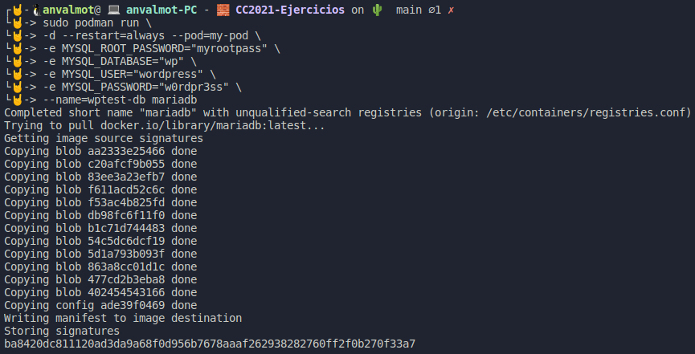

Una vez que tenemos el contenedor con la base de datos, vamos a crear el contenedor con Wordpress, que a su vez hará uso de la base de datos definida anteriormente.

```shell
sudo podman run \
-d --restart=always --pod=my-pod \
-e WORDPRESS_DB_NAME="wp" \
-e WORDPRESS_DB_USER="wordpress" \
-e WORDPRESS_DB_PASSWORD="w0rdpr3ss" \
-e WORDPRESS_DB_HOST="127.0.0.1" \
--name wptest-web wordpress
```
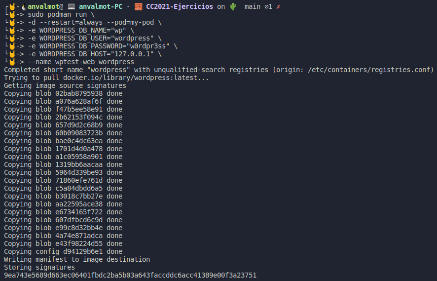

Una vez que tenemos creados ambos contenedores dentro del pod, podemos comprobar el contenido de éste:

```shell
sudo podman pod ls
```
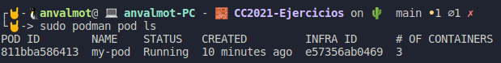

También podemos ver los contenedores que se están ejecutando:

```shell
sudo podman ps
```
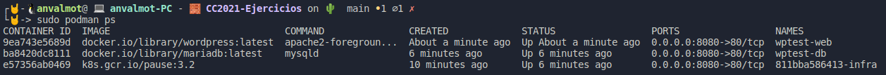

Llegados a este punto, si desde el navegador, accedemos a la dirección http://localhost:8080, deberíamos poder observar la web de instalación de wordpress:

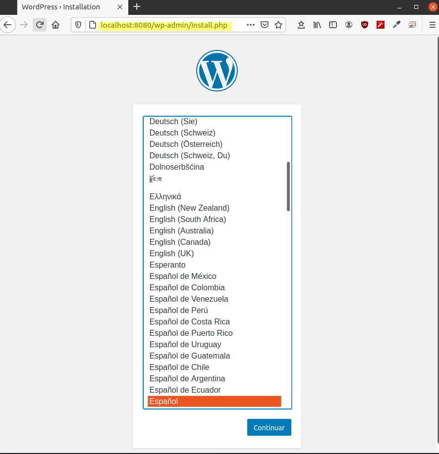


---
#### Ejercicio 2: Usar un miniframework REST para crear un servicio web y introducirlo en un contenedor, y componerlo con un cliente REST que sea el que finalmente se ejecuta y sirve como “frontend”.

Para este ejercicio vamos a crear un servicio web sencillo usando como lenguaje python y como miniframework Flask. Como cliente crearemos un servicio que haga de frontend y usaremos React para ello.


Para realizar este ejercicio he creado un directorio llamado [server](src/Tema3/Ej7/server/) que se encargará de guardar el servidor y otro directorio llamado [client](src/Tema3/Ej7/client/) que se encargará de almacenar el cliente en React.

Para crear el servicio web usando Flask, lo primero que hay que hacer es instalar en nuestra distribución de python, Flask. En mi caso he usado python 3, y por tanto he usado el siguiente comando:

* `pip3 install Flask`

Para que posteriormente nos sea más cómodo crearemos un fichero requirements.txt con todas las dependencias

Una vez instalado, creamos un fichero donde vamos a crear el servidor. Este fichero ha sido llamado [server.py](src/Tema3/Ej7/server/server.py)

```python
from flask import Flask, jsonify
from animals import animals
from flask_cors import CORS
app = Flask(__name__)
CORS(app)


@app.route("/", methods=['GET'])    
def animalsHandler():    
    return jsonify({"animals":animals})


if __name__ == '__main__':
    app.run(debug=True, host='0.0.0.0', port=5000)

```
Como se puede ver en el código anterior, lo que hemos definido a sido una ruta y una respuesta que nuestro servidor debe proporcionar cuando desde el cliente se solicite dicha ruta. La respuesta será en formato json y devolverá un conjunto de animales que previamente hemos definido en el fichero [animals.py](src/Tema3/Ej7/server/animals.py). 

```python
animals = [
    {
        "animal": "león",
        "especie": "mamífero",
        "alimentacion": "carnívoro"
    },
    {
        "animal": "vaca",
        "especie": "mamífero",
        "alimentacion": "herbívoro"
    },
    {
        "animal": "tiburón",
        "especie": "pez",
        "alimentacion": "carnívoro"
    },
    {
        "animal": "águila",
        "especie": "ave",
        "alimentacion": "carnívoro"
    },
    {
        "animal": "cocodrilo",
        "especie": "reptil",
        "alimentacion": "carnívoro"
    },
    {
        "animal": "sapo",
        "especie": "anfibio",
        "alimentacion": "carnívoro"
    }
]
```

Hecho esto si ejecutamos `python3 server.py` el servidor debería funcionar y escucharía en el puerto 5000.

El siguiente paso es definir un Dockerfile para ejecutar este servidor en un contenedor. Para ello hemos escrito el siguiente [dockerfile](src/Tema3/Ej7/server/Dockerfile):


```shell
# Dockerfile
FROM alpine:3.10
RUN apk add --no-cache python3-dev \
    && pip3 install --upgrade pip
WORKDIR /app
COPY . /app
RUN pip3 --no-cache-dir install -r requirements.txt
CMD ["python3","server.py"]
```

Llegados a este punto ya tendríamos lista la parte del servidor y podríamos ejecutarlo usando los siguientes comandos:

* `docker build -t my_docker_flask . `
* `docker run -it  -p 5000:5000  my_docker_flask`

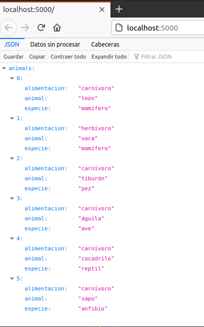

Para crear el cliente vamos a usar React, para ello lo primero es crear el proyecto:

* `npx create-react-app client `

Una vez creado vamos a instalar las principales depedencias:

Para hacer peticiones al servidor
* `yarn add axios` 

Para formatear la tabla donde mostrar los datos
* `yarn add react-bootstrap-table`

Hecho esto, se habrán añadido al fichero [package.json](src/Tema3/Ej7/client/package.json).

Ahora, modificaremos el fichero que se encargará de realizar la petición al servidor usándo axios, recibir la respuesta con los datos y formatearla en una tabla para lo que he usado boostrap. Este fichero en concreto es el [App.js](src/Tema3/Ej7/client/src/App.js)
 
```javascript
import React, { useState } from "react";
import axios from "axios";
import { BootstrapTable, TableHeaderColumn } from "react-bootstrap-table";
import "./App.css";

const App = () => {
  const [values, setValues] = useState({
    animals: [],
  });

  const { animals } = values;

  React.useEffect(() => {
    setValues({ ...values });
    axios({
      method: "GET",
      url: `http://localhost:5000/`,
      headers: {
        "Content-Type": "application/json",
        Accept: "application/json",
      },
    })
      .then(function (response) {
        setValues((values) => ({
          ...values,
          animals: response.data.animals,
        }));
        console.log(response.data.animals);
      })
      .catch(function (error) {
        console.log(error);
      });
  }, []);

  if (animals.length > 0) {
    return (
      <div className="App-header">
        <h1>Animales</h1>
        <BootstrapTable data={animals}>
          <TableHeaderColumn dataField="animal" isKey>Animal</TableHeaderColumn>
          <TableHeaderColumn dataField="especie">Especie</TableHeaderColumn>
          <TableHeaderColumn dataField="alimentacion">Alimentacion</TableHeaderColumn>
        </BootstrapTable>
      </div>
    );
  } else {
    return <p className="text-center">No hay animales que mostrar</p>;
  }
};
export default App;
```

Para que se apliquen los estilos a la tabla hay que importar en el fichero [index.html](src/Tema3/Ej7/client/public/index.html) lo siguiente:

```html
<link rel="stylesheet" href="https://maxcdn.bootstrapcdn.com/bootstrap/4.0.0/css/bootstrap.min.css"
    integrity="sha384-Gn5384xqQ1aoWXA+058RXPxPg6fy4IWvTNh0E263XmFcJlSAwiGgFAW/dAiS6JXm" crossorigin="anonymous">
```

Llegados hasta aquí podríamos ejecutarlo usando:

* `yarn start`

Esto despliega la aplicación en el puerto 3000:

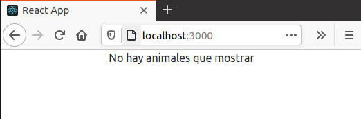

El siguiente paso es definir el [Dockerfile](src/Tema3/Ej7/client/Dockerfile) para ejecutarlo dentro de un contenedor:

```shell
FROM node:12-alpine
RUN mkdir -p /home/node/app/node_modules \
    && chown -R node:node /home/node/app
WORKDIR /home/node/app
COPY package*.json ./
USER node
COPY --chown=node:node . .
RUN yarn  
EXPOSE 3000
CMD ["yarn", "start"]
```
Adicionalmente, para evitar que se copie la carpeta `node_modules` dentro del contenerdo podemos hacer uso de otro fichero denominado [.Dockerignore](src/Tema3/Ej7/client/.Dockerignore):

```shell
./node_modules
```
Ejecutamos el contenedor usando los siguientes comandos:

* `docker build -t my_docker_react . `
* `docker run -it -p 3000:3000  my_docker_react`

Con esto tendríamos los dos servicios montados por separado, el siguiente paso es agruparlos y desplegarlos a la misma vez. Para esto definimos un nuevo fichero en el raíz del ejercicio, al que llamamos [docker-compose.yml](src/Tema3/Ej7/docker-compose.yml) y en el que incluimos lo siguiente:

```yml
version: '2'
services:
   server:
      container_name: server
      restart: always
      build: server/.
      ports:
      - "5000:5000"

   client:
      container_name: client
      build: client/.
      stdin_open: true
      ports:
      - "3000:3000"
```
como se puede ver, definimos dos servicios uno servidor y otro cliente, escuchando en sus respectivos puertos y le indicamos también los respectivos directorios. Esto hará que busquen en dichos directorios el correspondiente fichero Dockerfile y lo ejecute:

Para desplegar ambos servicios, debemos ejecutar los siguientes comandos:

Si queremos que cree la imagen de nuevo si ya estaban creadas:
* `docker-compose up --build`
Si solo queremos que levante los servicios:
* `docker-compose up`

Podemos ver a continuación que ambos servicios se han levantado:

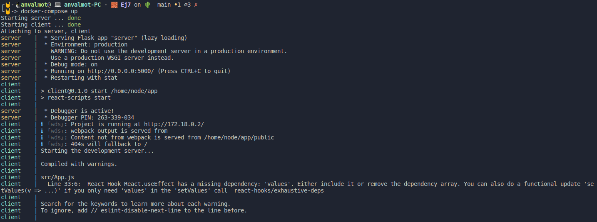

Finalmente, podemos comprobar que ahora tenemos desplegados y ejecutándose ambos contenedores:

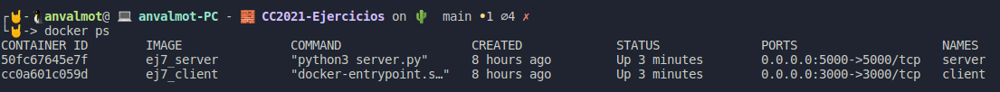

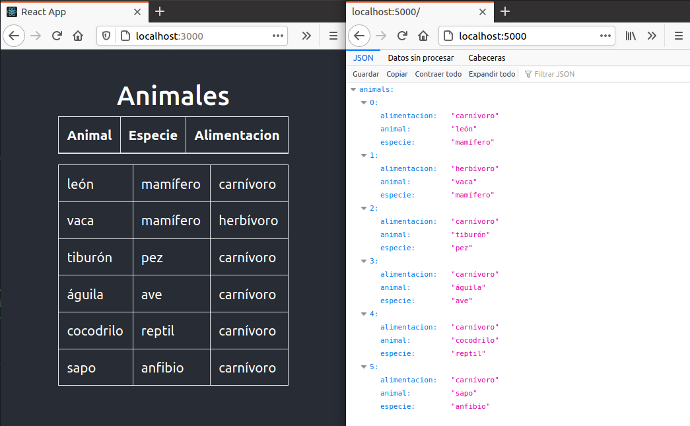